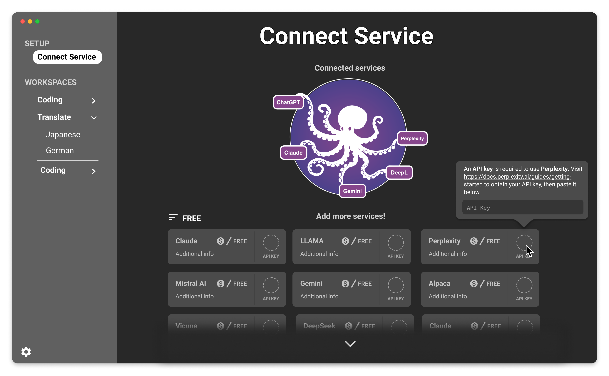
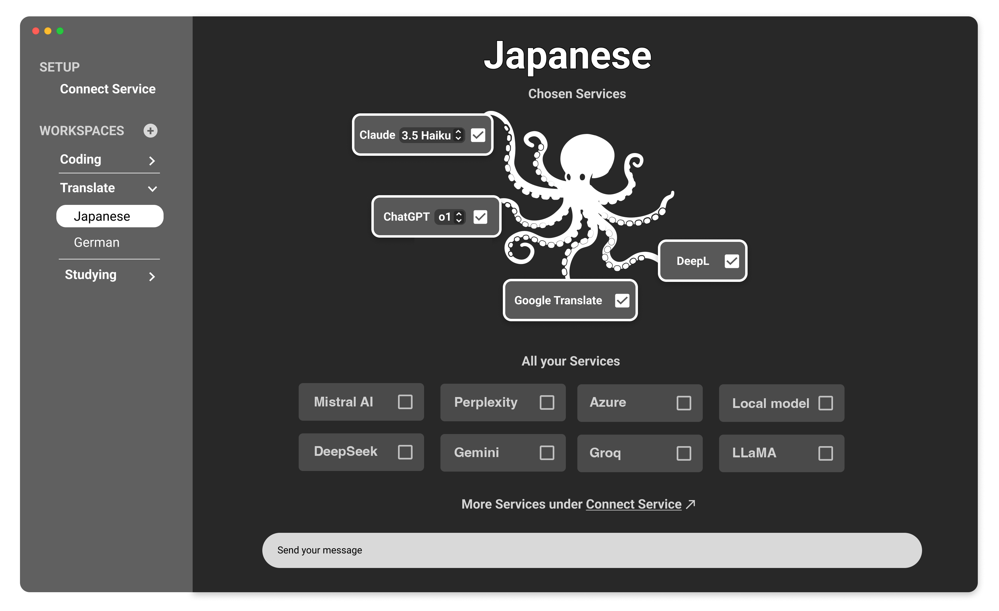
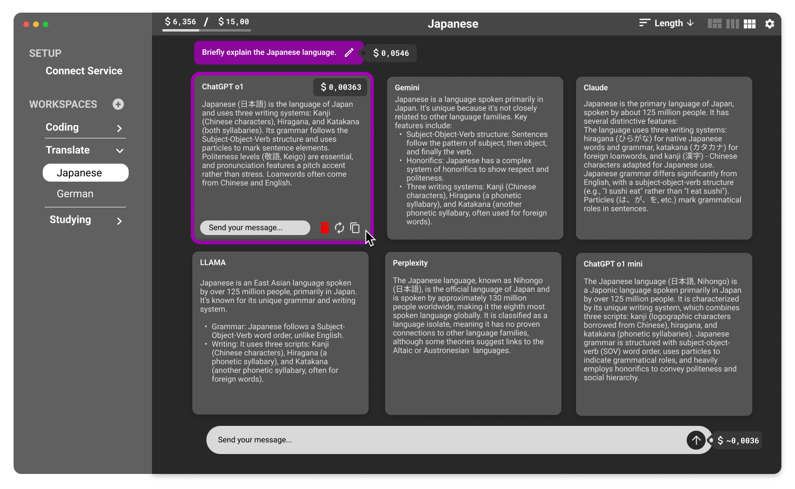
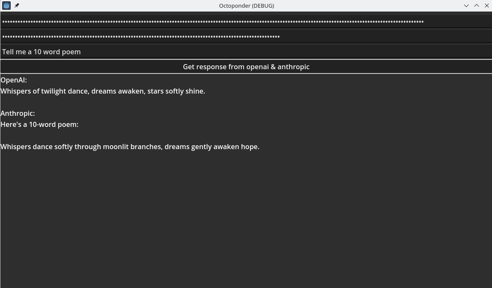

# Octoponder

Octoponder is a native application for desktop and mobile platforms that allows users to interact with multiple Large Language Models (LLMs) simultaneously. By selecting relevant services or local models, users can compare responses side by side and pick the most suitable answer for their needs. This approach leverages the unique strengths of various models while promoting user privacy, especially through the option to run offline-capable models.

## Features
* Support for multiple LLMs in a unified interface.
* Use your own API keys for online providers.
* Configurable workspaces for different tasks or domains.
* Integration of both online APIs and offline-capable models for increased privacy.
* Prompt analysis and suggestions to optimize query results.
* Cost transparency for queries and answers.
* Accessibility-focused interface built with Godot, offering controller support, Text-to-Speech, and other inclusive features.

## Technical Overview
* Core functionality is provided by our Rust library [Inklings](https://github.com/Octoponder/Inklings) that integrates with multiple LLM APIs.
* The library compiles across all major platforms and exposes a C-compatible API and will offer JS and Python language bindings and packages for easy adoption.
* The Godot engine powers the user interface, enabling a unified and performant cross-platform UI.

## Designs

Setting up LLM API keys

Start screen for Japanese workspace

Sending a message

## Current Status
A proof-of-concept has validated the technology stack:

## Running the project
* Clone the project.
* Inside the `rust` subfolder, run `cargo build`.
* Open the `godot` subfolder in Godot.
* Run the project.

## Roadmap
* Support additional LLM providers and tools.  
* Improve UI/UX.
* Incorporate advanced tutorial features to help users craft more effective prompts.
* Integration of local models for offline operation.  

